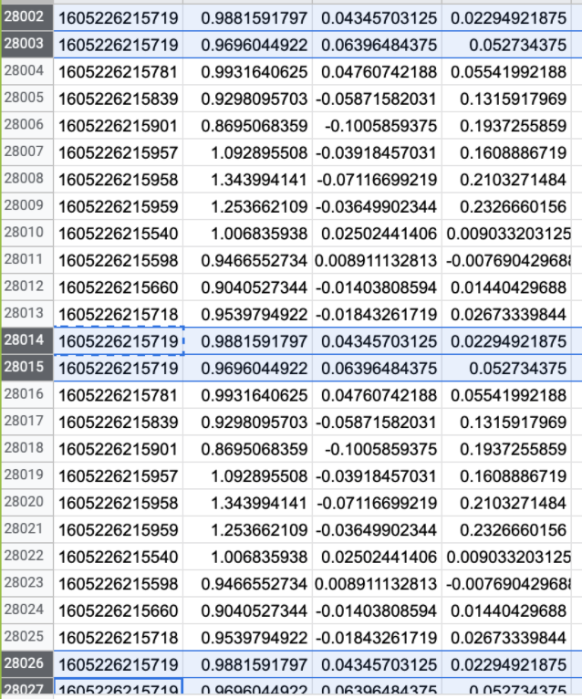

# Challenge 1

* Most of the work in this area uses a combinations of sensors at multiple locations (ankle, chest, wrist etc). Most of these sensors are not available to users in real-time making such work impractical. 
* Therefore, we are targeting human activity detection using only a wrist watch which is very common nowadays (According to Pew Research Center, [About one-in-five Americans use a smart watch or fitness tracker](https://www.pewresearch.org/fact-tank/2020/01/09/about-one-in-five-americans-use-a-smart-watch-or-fitness-tracker/)). 
* Combination of multiple sensors provides a good set of distinguishing features which makes it easy for the model to detect multiple activities. 
* Whereas, in this project, the limited set of sensors made it difficult for our model to distinguish between activities. 
* To fix this problem, we have used multiple approaches such as merging similar activities, adding untargeted activities, adding features like mean and standard deviation etc.

# Challenge 2

* We started our project using the MotionSense HRV wearable and the mCerebrum app to collect real-time data.  
* However, the app was giving a lot of problems. For example, we were seeing multiple data values for same timestamps in the csv file as shown in the following figure:

    

* Debugging the MotionSense HRV wearable and app took around 2 weeks.  
* This left us with less time to work on the project using Apple Watch.  

# Challenge 3

* Model training and real-time inference are performed on data collected from different sensors.  
* To prevent the trained model from getting biased to data from one type of sensor, we trained the model on two different datasets (using different sensors).  
* We observed that using this combination of datasets improved our real-time inference accuracy significantly. 

# Challenge 4

* To train our model with good accuracy, we needed datasets with a large number of users and with our target sensors and activities.  
* Looking for such relevant datasets took a significant amount of time.
