# Table of Contents

1. [Problem Statement](#problem-statement)
2. [System Overview](#system-overview)
3. [Training Data](#training-data)  
   3.1 [Datasets Used](#datasets-used)  
   3.2 [Data Preprocessing](#data-preprocessing)
4. [Real-Time Data](#real-time-data)  
   4.1 [Data Collection](#data-collection)  
   4.2 [Data Preprocessing](#data-preprocessing)
5. [Machine Learning Model](#machine-learning-model)  
   5.1 [Model Topologies Tried](#model-topologies-tried)  
   5.2 [Model Topology Selection](#model-topology-selection)  
   5.3 [Model Training](#model-training)
6. [Real-Time Inference](#real-time-inference)  
   6.1 [Inference for Model Development](#inference-for-model-development)  
   6.2 [Inference for Demo](#inference-for-demo)  
7. [Platforms Used](#platforms-used)  
   7.1 [Google Drive](#google-drive)  
   7.2 [Google Colaboratory](#google-colaboratory)  
   7.3 [TensorFlow](#tensorflow)  
   
# Problem Statement
In this project, we are detecting human activities using machine learning model on the IMU data (accelerometer and gyroscope) collected from Apple Watch worn by the user on their dominant hand. We are targeting the detection of following human activities:
* Walking
* Sitting
* Eating
* Brushing Teeth

# System Overview 
The diagram below shows the overall approach used in this project:

    

# Training Data

## Datasets Used

We started our project with PAMAP2 dataset but the trained model's accuracy was not good enough on the real-time data we collected. This was because PAMAP2 dataset is too small to train a large model successfully. Therefore, we tried with a bigger dataset (WISDM dataset) which has data for 51 users. This dataset was good enough to train a large model but the problem with this dataset is that after training, the model is used to predict activities from data collected in real-time which uses different sensors as compared to this dataset. So, to prevent the trained model from getting biased towards any particular dataset (i.e data collected from a particular type of sensor), we finally used a combination of WISDM and PAMAP2 datasets.

Link to the datasets: **[PAMAP2](https://archive.ics.uci.edu/ml/datasets/WISDM+Smartphone+and+Smartwatch+Activity+and+Biometrics+Dataset+) [WISDM](https://archive.ics.uci.edu/ml/datasets/PAMAP2+Physical+Activity+Monitoring)** 

Raw dat files for PAMAP2 can be found here : **[Data/PAMAP2_Dataset/Protocol](https://github.com/gargbruin/WALG/tree/main/Data/PAMAP2_Dataset/Protocol)**  
Raw csv files for WISDM can be found here : **[Data/WISDM_Dataset/raw/watch](https://github.com/gargbruin/WALG/tree/main/Data/WISDM_Dataset/raw/watch)**  

## Data Preprocessing

    

Following are the various steps used in preprocessing the training datasets:
* **Sampling Frequency**: WISDM and PAMAP2 use sampling frequencies of 20 Hz and 100 Hz respectively. Therefore, to match their sampling frequencies, PAMAP2 dataset has been downsampled to match WISDM's frequency.
* **Sliding Window**: We are using the sliding window approach to split data into fixed size windows. With experimentation, we found that a sliding window of 10 seconds (200 samples) and a stride of 2 seconds (40 samples) gives us the best training and inference accuracy for all targeted activities. 
* **Mean and Standard Deviation**: Most of the reference HAR work uses multiple sensors at different locations (like ankles, wrist, chest etc). However, in this project, we are detecting human activities based on two sensors' data (accelerometer, gyroscope) only and that too from just one location (wrist). To recover the accuracy loss because of a limited number of input features (sensors), we added additional features like mean and standard deviation to the sampled windows.

Our combined training data has 60 unique users which performed all the targeted activities. To perform validation and testing accurately, users to validate and test the model are not being used for training. The processed training dataset has been divided into following subsets:

    

This division of data in three subsets (training, validation and testing) has been done randomly. The following snippet of the data-processing script selects subjects randomly for the three subsets: 

  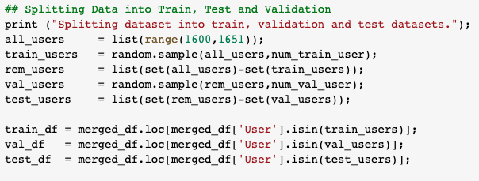  

The final dataset used for training, validation and testing of the network has the following distribution:

  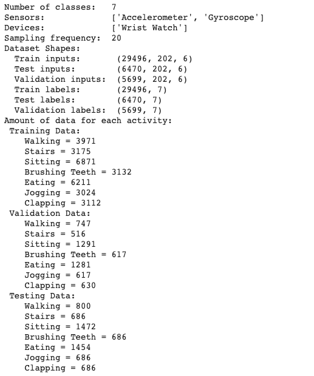  

Link to notebook used for PAMAP2 dataset preprocessing: **[Notebooks/Preprocess_PAMAP2.ipynb](https://github.com/gargbruin/WALG/blob/main/Notebooks/Preprocess_PAMAP2.ipynb)**  
Link to notebook used for WISDM+PAMAP2 dataset preprocessing: **[Notebooks/Preprocess_WISDM_PAMAP2.ipynb](https://github.com/gargbruin/WALG/blob/main/Notebooks/Preprocess_WISDM_PAMAP2.ipynb)**  
Processed numpy files for PAMAP2 can be found here : **[Data/PAMAP2](https://github.com/gargbruin/WALG/tree/main/Data/PAMAP2)**  
Processed numpy files for PAMAP2+WISDM can be found here : **[Data/WISDM_PAMAP2](https://github.com/gargbruin/WALG/tree/main/Data/WISDM_PAMAP2)**  

# Real-Time Data 

## Data Collection
We are using the SensorLog app on Apple Watch to collect 6-DOF IMU data (accelerometer and gyroscope). The Apple Watch is worn by the user on their dominant hand. The SensorLog app can sample the data at a frequency of upto 100 Hz. Since our processed training data has a sampling frequency of 20 Hz, we are using the app to collect the IMU data at the same frequency. The app provides us data in the csv format. Once we have the csv files from the Apple Watch, these files are uploaded on Google Drive for further processing and inference. 

    
    

Raw csv files can be found here : **[Data/Live_Data/raw](https://github.com/gargbruin/WALG/tree/main/Data/Live_Data/raw)**  

## Data Processing

    

We run a preprocessing python script on the raw data that performs the following operations:
* **Sampling Frequency**: SensorLog app allows us to directly sample  the data at 20 Hz.
* **Sliding Window**: We are using the sliding window approach to split data into fixed size windows of 10 seconds (200 samples) and a stride of 2 seconds (40 samples). 
* **Mean and Standard Deviation**: Similar to the training dataset, we are adding additional features like mean and standard deviation to the sampled windows.

Link to notebook used for real-time data preprocessing: **[Notebooks/Preprocess_Live_Data.ipynb](https://github.com/gargbruin/WALG/blob/main/Notebooks/Preprocess_Live_Data.ipynb)**  
Processed numpy files can be found here : **[Data/Live_Data/processed](https://github.com/gargbruin/WALG/tree/main/Data/Live_Data/processed)**

# Machine Learning Model

## Model Topologies Tried

We experimented with multiple different neural network topologies like MLPs, CNNs, LSTMs and ConvLSTMs to perform this task of human activity recognition. Below is the list of network topologies we tried and their training and validation accuracies for 70 epochs.

### Multi Level Perceptron (MLP)

A multilayer perceptron (MLP) is a class of feedforward artificial neural network (ANN). An MLP consists of at least three layers of nodes: an input layer, a hidden layer and an output layer. Its multiple layers and non-linear activation distinguishes data that is not linearly separable.

  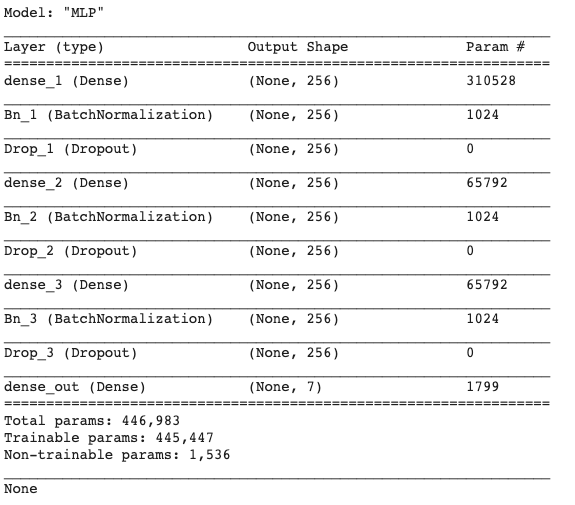  
  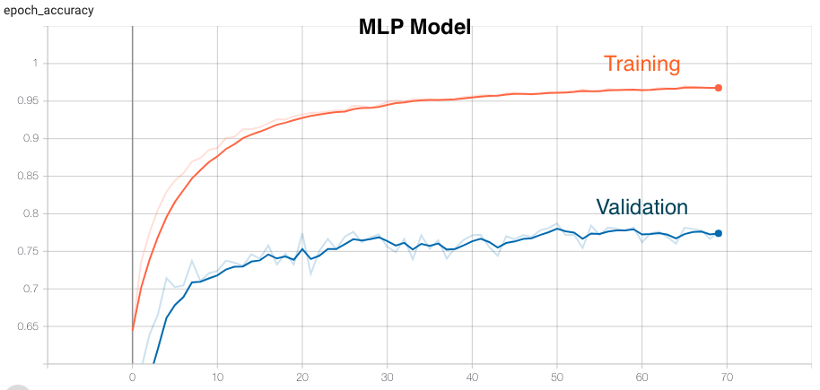  

### Long Short-Term Memory (LSTM)

Long Short-Term Memory (LSTM) networks are a type of recurrent neural network capable of learning order dependence in sequence prediction problems. This is a behavior required in complex problem domains like machine translation, speech recognition, human activity recognition and more.

  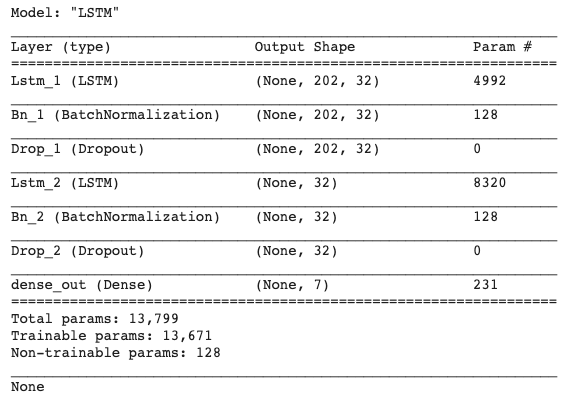  
  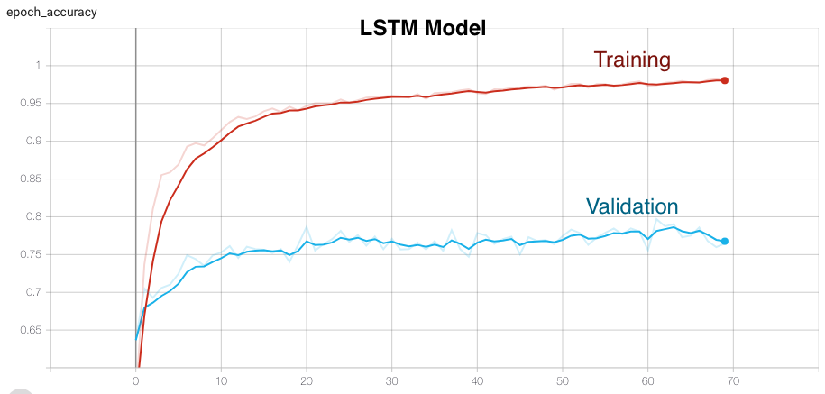  

### Convolutional Neural Networks (CNN)

A convolutional neural network (CNN, or ConvNet) is a class of deep neural networks, most commonly applied to analyzing visual imagery. They have applications in image and video recognition, recommender systems, image classification, medical image analysis, natural language processing, brain-computer interfaces, and financial time series. CNNs are regularized versions of multilayer perceptrons. Multilayer perceptrons usually mean fully connected networks, that is, each neuron in one layer is connected to all neurons in the next layer. CNNs take advantage of the hierarchical pattern in data and assemble more complex patterns using smaller and simpler patterns. Therefore, on the scale of connectedness and complexity, CNNs are on the lower extreme.

  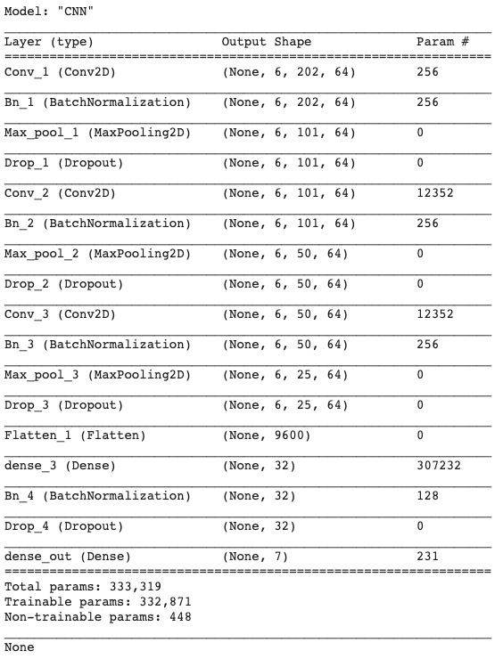  
  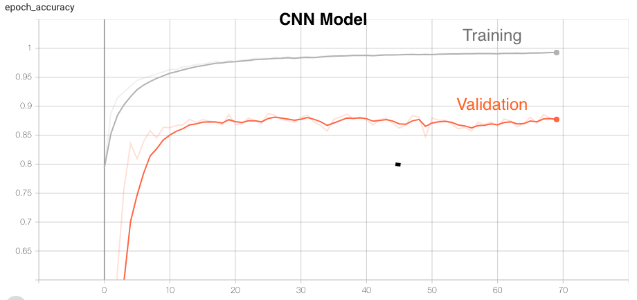  

### Convolutional Long Short-Term Memory (ConvLSTM)

ConvLSTM is an integration of a CNN (Convolutional layers) with an LSTM. First, the CNN part of the model process the data and one-dimensional result feed an LSTM model.

  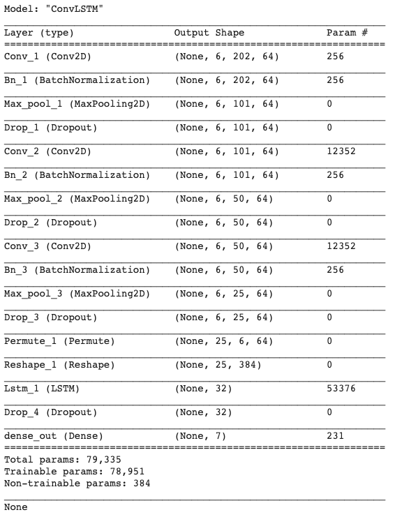  
  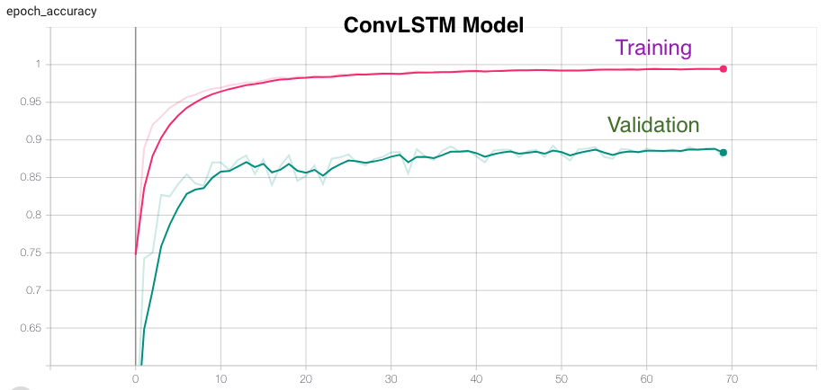  

## Model Topology Selection

Below table shows various accuracies (training, validation, testing) and the activities which are correctly predicted from real-time data by the different network topologies:  

| Model  Topology | Training  Accuracy | Validation Accuracy | Testing  Accuracy | Activities  predicted correctly Real-Time Data |
|:---------------:|:------------------:|:-------------------:|:-----------------:|:----------------------------------------------:|
| MLP             |        96.77       |        78.72        |       81.64       |                      None                      |
| LSTM            |        98.04       |        79.68        |       82.63       |                      None                      |
| CNN             |        99.26       |        88.74        |       92.60       |                       All                      |
| ConvLSTM        |        99.47       |        89.23        |       93.32       |                Sitting & Eating                |

From this table, we can say that CNNs work best for us because of the following reasons:
* Although MLP and LSTM has very good training accuracies but the validation and test accuracy are not very good. Moreover, trained models with these topologies are not able to correctly predict any activity from the data collected from real-time setup.
* ConvLSTM has very good accuracies (comparable to CNNs) for training, validation and testing. But trained ConvLSTM model is able to correctly predict only half of the target activities.
* CNN has good training, validation and test accuracies as well as trained CNN model is able to correctly predict all the target activities.

## Model Training

We tried training the model with different number of epochs and batch sizes and settled with 70 epochs with a batch size of 256. The model accuracy starts saturating in the range of 60-70 epochs. It takes around 4 minutes and 40 seconds to train and validate the model. After training, the best model is saved which is later on loaded for inference with the test data and real-time data.

Strategies used to improve the model's accuracy:

* **Network Tuning**: To improve the model’s accuracy, we tried many different network configurations like changing number of layers, number of features per layer, adding different types of layers like BatchNormalization, Dropout etc. 
* **Merge Activities**: Both the origional datasets were using multiple sensors at different locations (PAMAP2 - ankle, wrist and chest; WISDM - phone and wrist). Whereas in this project we are targeting detection based only on the accelerometer and gyroscope data obtained only from wrist. This reduction in number of features makes it difficult to diffrentiate between various activities, especially the ones which are very simillar. This was further resulting in reduced accuracy of our model. To fix this problem, we are merging data for multiple simillar activities under signle label. 

|       Label     |     Original Activities     |
|:---------------:|:---------------------------:|
| Walking         | Walking                     |        
| Sitting         | Sitting, Typing             |
| Eating          | Eating Chips, Eating Pasta  |   
| Brushing Teeth  | Brushing Teeth              | 

This merging of activities also helps us to increase the amount of data per label.
* **Additional Activities**: While experimenting, we observed that adding some of extra activities (which are not targeted) help to improve the prediction accuracy for the targeted activities. For example, adding data for clapping, stairs and jogging helped us to improve the accuracy for eating and walking. We believe, this could be because of the fact that these additional activities help the model to have more distinguishing features between the activities. 
* **Window Size**: We experimented with different window sizes for splitting the data into samples. As per observation, small windows (2 -4 seconds) are good for activities like walking and sitting where activities like eating and brushing teeth needs bigger window sizes (20-25 seconds). Therefore, we are using an intermediate value of 10 seconds for window size.

Link to notebook used for network training: **[Notebooks/WALG.ipynb](https://github.com/gargbruin/WALG/blob/main/Notebooks/WALG.ipynb)**

# Real-Time Inference

## Inference for Model Development
In order to verify the accuracy of our model on real-time data, we collected multiple data files for each target activity with two different subjects. This was done using the procedure explained in Real-Time Data section. These data files were used to make decisions in the model development process. These raw data files were preprocessed as explained in Real-Time Data - Data Preprocessing section.

Below is the snapshot of the script used for making inference:

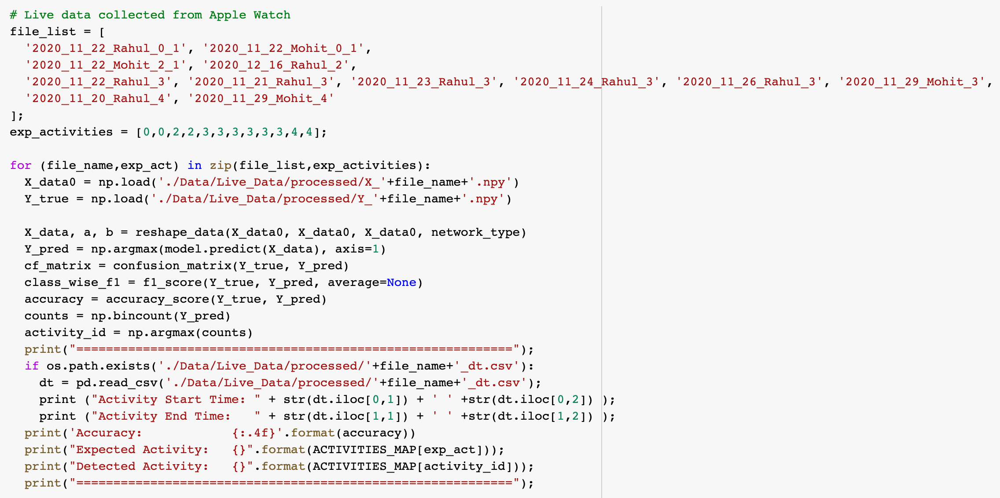

Below are the results of the inference from the trained model:

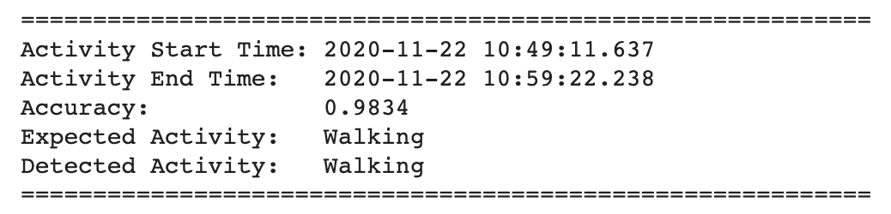
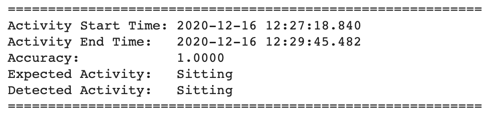
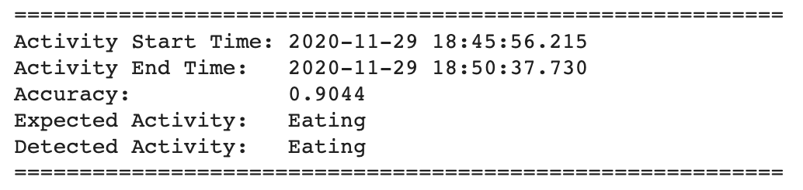
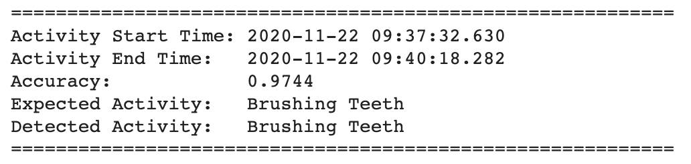

Raw csv files can be found here : **[Data/Live_Data/raw](https://github.com/gargbruin/WALG/tree/main/Data/Live_Data/raw)**  
Processed numpy files can be found here : **[Data/Live_Data/processed](https://github.com/gargbruin/WALG/tree/main/Data/Live_Data/processed)**

## Inference for Demo

For final demo, we are using a different subject than the ones which were used during model development. Our subject performed all 4 target activities consecutively. We recorded a video with timestamps and collected sensor data using SensorLog app. Python script in "[WALG_Demo.ipynb](https://github.com/gargbruin/WALG/blob/main/Notebooks/WALG_Demo.ipynb)" notebook is used to first pre-process the raw data and then pretrained model is used to make predictions. 

In order to filter the noise, predicted values are postprocessed by the same script. We are using a running window which compares the prediction for last three samples before giving a final processed prediction. Following is the snapshot of the script used for post-processing the predictions:

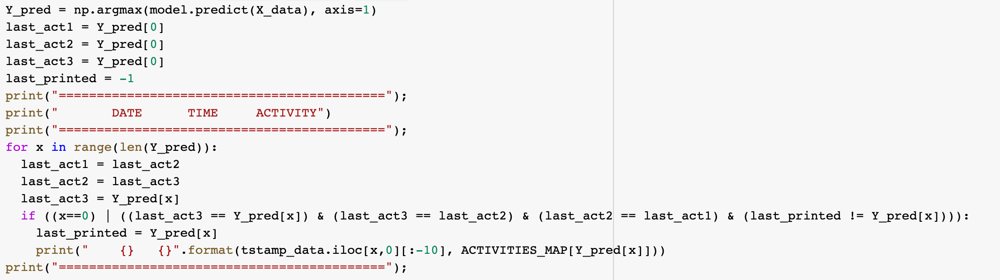

Link to the video used for demo: ???

Following are the predictions made by our model:

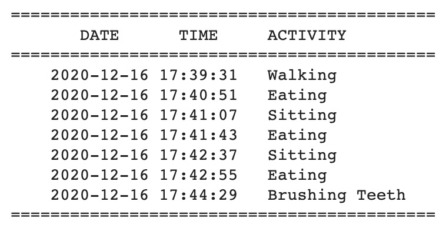

Link to raw data used for demo: **[Data/Live_Data/raw/2020_12_16_Suparno_All.csv](https://github.com/gargbruin/WALG/tree/main/Data/Live_Data/raw/2020_12_16_Suparno_All.csv)**  
Link to processed data used for demo: **[Data/Live_Data/processed/X_2020_12_16_Suparno_All.npy](https://github.com/gargbruin/WALG/tree/main/Data/Live_Data/processed/X_2020_12_16_Suparno_All.npy)**  
Link to the file storing timestamps for demo: **[Data/Live_Data/tstamps/2020_12_16_Suparno_All_tstamps.csv](https://github.com/gargbruin/WALG/tree/main/Data/Live_Data/tstamps/2020_12_16_Suparno_All_tstamps.csv)**  

# Why Deep Learning for HAR?
In this project, we are using deep learning approach over other classical approaches because of the following reasons:
* Classical methods requires deep expertise in the field and also requires a significant knowledge of signal processing.
* With the ubiquitous presence of smart wearable devices like Apple Watch, Fitbit bands etc around us, a lot of sensor data is now available for deep learning based approaches.
* Because of it's application in multiple fields, a lot of research has been going on in the field of machine learning. This research is resulting in many advancements which can be utilized in field of Human Activity Recognition (HAR) too.

# Platforms Used

    

## Google Drive

We stored all our data on Google Drive. The Shared Drives feature helped us a lot in collaboration.

## Google Colaboratory

All python scripting was done on Google Colab. Linking Drive with Colab allowed easy access to the data.

## TensorFlow

All the model development and training was done using TensorFlow.

