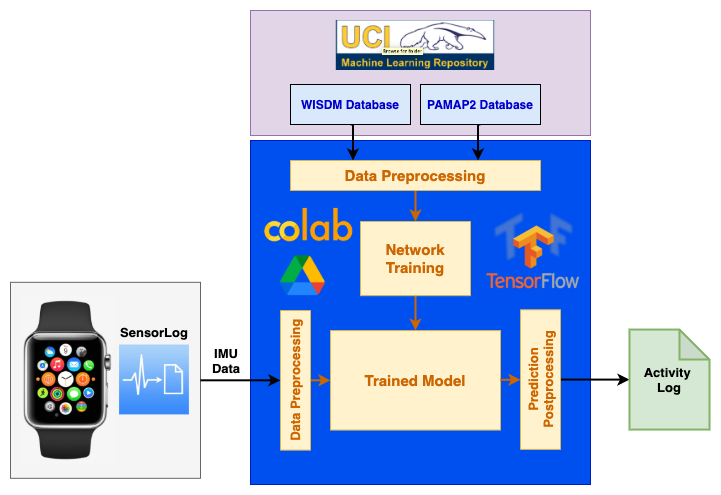
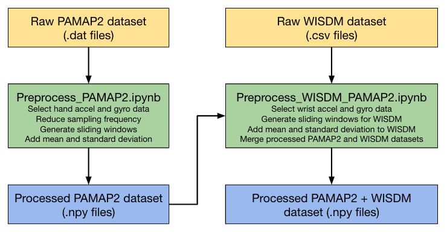
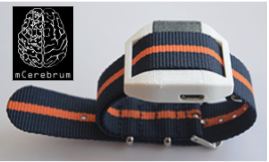
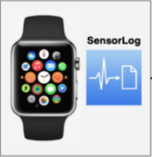
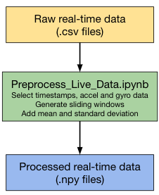
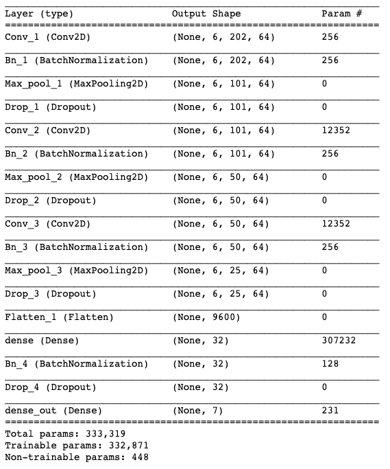
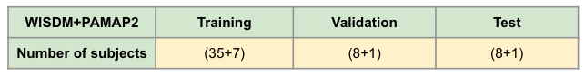

# Table of Contents

1. [System Overview](#system-overview)
2. [Training Data](#training-data)  
   2.1 [Datasets Used](#datasets-used)  
   2.2 [Data Preprocessing](#data-preprocessing)
3. [Real-Time Data](#real-time-data)  
   3.1 [Data Collection](#data-collection)  
   3.2 [Data Preprocessing](#data-preprocessing)
4. [Machine Learning Model](#machine-learning-model)  
   4.1 [Model Topology](#model-topology)  
   4.2 [Model Training](#model-training)
5. [Real-Time Inference](#real-time-inference)  
6. [Platforms Used](#platforms-used)  
   6.1 [Google Drive](#google-drive)  
   6.2 [Google Colaboratory](#google-colaboratory)  
   6.3 [TensorFlow](#tensorflow)  
   
# System Overview 
In this project, we are using the sensor data retrieved from wearable devices to recognize and log the human activities using deep learning approach. We are using the IMU data (accelerometer, gyroscope) obtained from an Apple Watch worn by the user on their dominant hand. The activities recognized are logged and stored in a pdf document. The diagram below shows the overall approach used in this project:

    

# Training Data

## Datasets Used

Link to the datasets: **[PAMAP2](https://archive.ics.uci.edu/ml/datasets/WISDM+Smartphone+and+Smartwatch+Activity+and+Biometrics+Dataset+) [WISDM](https://archive.ics.uci.edu/ml/datasets/PAMAP2+Physical+Activity+Monitoring)** 

Raw dat files for PAMAP2 can be found here : **[Data/PAMAP2_Dataset/Protocol](https://github.com/gargbruin/WALG/tree/main/Data/PAMAP2_Dataset/Protocol)**  
Raw csv files for WISDM can be found here : **[Data/WISDM_Dataset/raw/watch](https://github.com/gargbruin/WALG/tree/main/Data/WISDM_Dataset/raw/watch)**  

## Data Preprocessing

    

Processed numpy files for PAMAP2 can be found here : **[Data/PAMAP2](https://github.com/gargbruin/WALG/tree/main/Data/PAMAP2)**  
Processed numpy files for PAMAP2+WISDM can be found here : **[Data/WISDM_PAMAP2](https://github.com/gargbruin/WALG/tree/main/Data/WISDM_PAMAP2)**  

# Real-Time Data 

## Data Collection
We are using the SensorLog app on Apple Watch to collect 6-DOF IMU data (accelerometer and gyroscope). The Apple Watch is worn by the user on their dominant hand. The SensorLog app can sample the data at a frequency of upto 100 Hz. Since our training data was collected at a sampling frequency of 20 Hz, we are using the app to collect the IMU data at the same frequency. The app provides us data in the csv format. Once we have the csv files from the Apple Watch, we upload them on Google Drive and run a preprocessing python script which peforms the following operations: 

    
    

Raw csv files can be found here : **[Data/Live_Data/raw](https://github.com/gargbruin/WALG/tree/main/Data/Live_Data/raw)**  

## Data Processing

    

* Filter the raw data to extract relevant features 
* Apply a sliding window to generate input data for the neural network 
* Save the processed data as numpy files

Processed numpy files can be found here : **[Data/Live_Data/processed](https://github.com/gargbruin/WALG/tree/main/Data/Live_Data/processed)**

# Machine Learning Model

## Model Topology

    

## Model Training

    

# Real-Time Inference

# Platforms Used

    

## Google Drive

## Google Colaboratory

## TensorFlow

